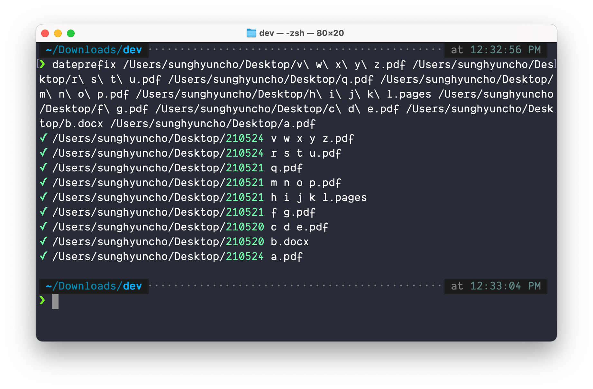

# Tool: Add "Date Created, Modified" Prefix To File

## Instructions

- `pip3 install -e *current_folder*`
- On your terminal, type `dateprefix` and drag multiple files
- Execute and enjoy

Runs like the following:

## Note

- It should _probably_ work with all sorts of files with all sorts of denormalized filenames, but I do not make any guarantee on any sort of potential data loss.
- Good idea to make a copy before doing anything...
- This was made for my personal internal use; use it at your own risk.

## References

- https://stackoverflow.com/questions/237079/how-to-get-file-creation-modification-date-times-in-python
- https://docs.python.org/ko/3/library/os.path.html
- https://stackoverflow.com/questions/27494758/how-do-i-make-a-python-script-executable
- https://stackoverflow.com/questions/287871/how-to-print-colored-text-to-the-terminal
